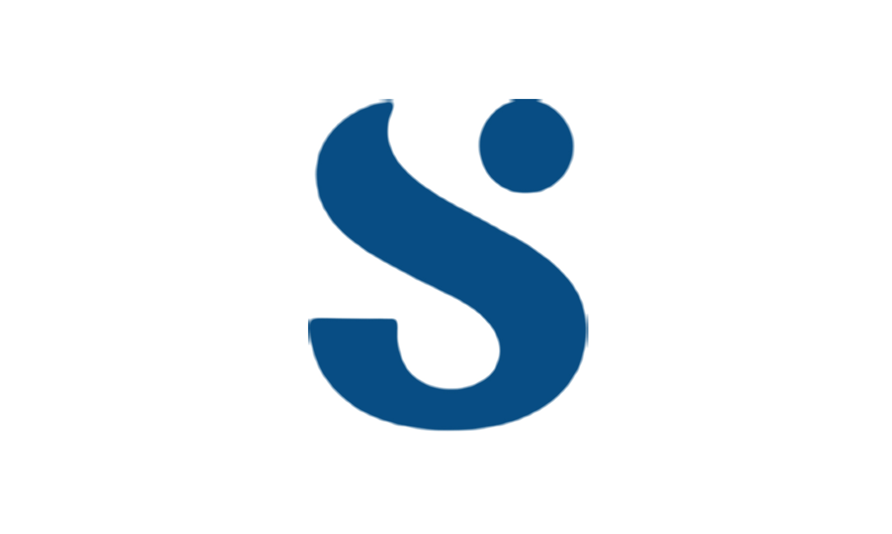

# surveil - Surveil Appblication

> An App to help service health and medical coditions.

Surveil API collects data sent from the mobile application to store it to the remote server. 

## Built With

- PHP 
- MySQL

## Live Demo

[Live Demo Link](https://github.com/csbasic/surveil)

## Getting Started

To get a local copy up and running follow these simple example steps.

Setup Git on your local environment to enable you clone the this project source code.

Setup a local production environment with `Wampserver or Xamppserver` for Winders,  `Nginx or xamppserver` for Ubuntu and Mac.

Clone the repo with `git clone https://github.com/csbasic/surveil`

Get the server running and create a database named `surveil` for simplicity or you might want to change the database name, then import the database tables.

## Author

👤 **Chi Serge**

- GitHub: [@githubhandle](https://github.com/csbasic)
- X: [@xhandle](https://twitter.com/chiserge_/)
- LinkedIn: [LinkedIn](https://www.linkedin.com/in/chiserge/)

## 📝 License

The PHP License is the open-source license under which the PHP scripting language is released, Starting with PHP 4, versions of the PHP software are distributed under the  [PHP License v3.01](http://www.php.net/license/3_01.txt).
